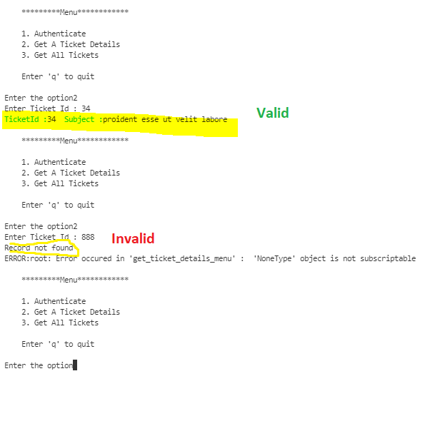
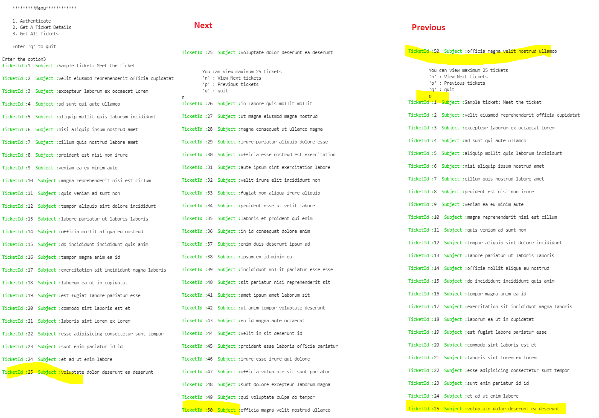

# ZenDesk Coding Challenge
- Summer internship 2022
- This is simple console application.

# Prerequisite 
- Python 3.8
- Create account [here](https://www.zendesk.com/register/#step-1) to access Zen Desk API
- Application required basic authentication mechanism. Thus, enable it.
     
      Admin -> Apps and Integrations -> APIs -> Zendesk API -> Settings -> Password Access
      or

      https://<<yourdoamin>>.zendesk.com/admin/apps-integrations/apis/apis/settings

    

# Steps To Run
- Clone the repository
- Edit CREDENTIALS in [Config.py](config.py) or Authenticate while running application
- Create python virtual enviornment
- Enter following commands:
    ```
        pip install -r requirements.txt
        python .\console.py
    ```

# Steps to run Unit Tests:
- Authentication must be successful in order to run other test cases
- Edit CREDENTIALS in [Config.py](config.py) or Authenticate [ZenDeskAPIHandlerTests.py](ZenDeskAPIHandlerTests.py), function test_Authenticate_user
- Enter following commands:
    ```        
        python .\ZenDeskAPIHandlerTests.py
    ```    

# Sample Output    
- Authenticate

     

- Get single Ticket without authentication
    
     
- Get single Ticket with authentication

     
- Get Multiple tickets
    

# Contact:
- EmailId : netranitin.amrale@sjsu.edu    